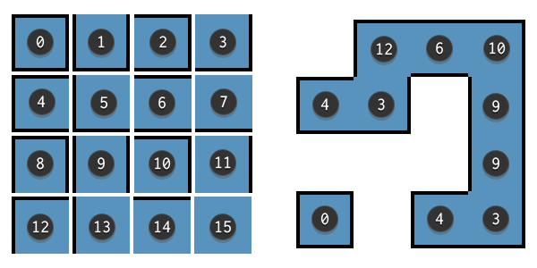
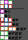

# GDevelop-AutoTile

This will auto setup your animations to make auto tile

### Download
<a href="https://raw.githubusercontent.com/FlokiTV/GDevelop-AutoTile/main/Extension.json" target="_blank" download>Extension.json</a>
### Online example: 
https://games.gdevelop-app.com/game-99e14dda-c05d-423d-b9aa-2c8ecdb8cab6/index.html

# How to seput animations

